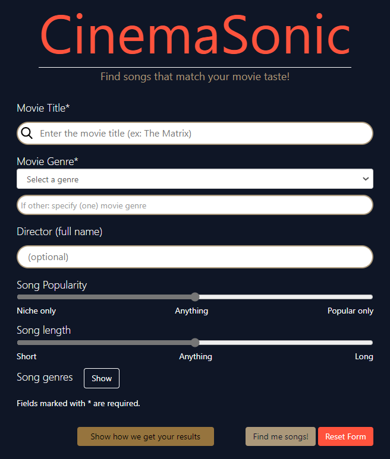
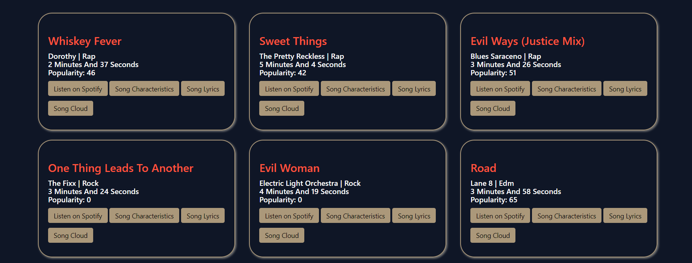
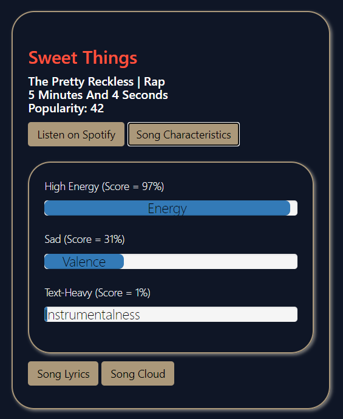
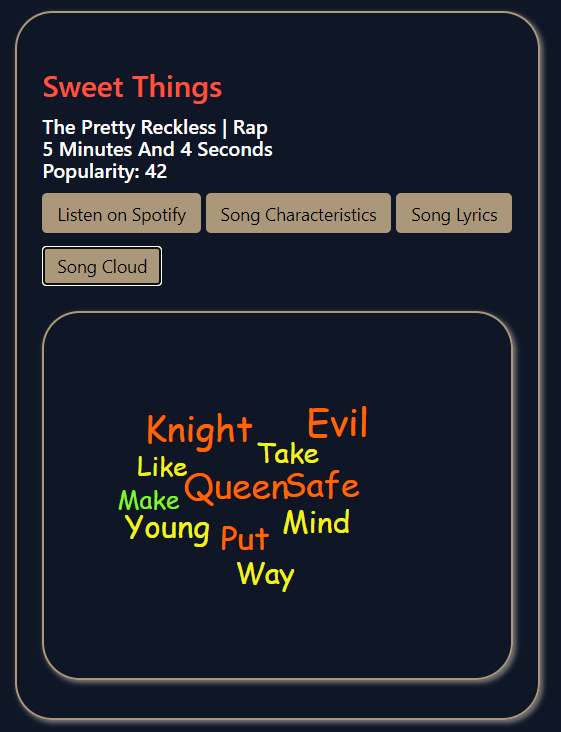

# Cinema Sonic
Cinema Sonic is an ad-hoc recommender that takes in a movie name and genre and outputs recommendations enlisting songs that the user might like. The recommender uses information retrieval and text mining techniques to provide results. 

 

This is developed as part of the final project for INFO/CS 4300 - Language and Information by a team of five members, whose information can be found in the Insights section. This project does build on the [template provided by the course staff](https://github.com/CornellNLP/4300-Template-Spring-2023). This repo specifically replaces the README.md from the [original project repo](https://github.com/ep393/4300-Template-Spring-2023).

## Demonstration of Features

 

Sample results are displayed as a grid of tiles. Each result contains song-related information, and additional fields like Spotify link, song lyrics, song characterics, and word cloud (words that reveal similarity between the movie and song).

## Running the App

To run the app, clone the repo and uncomment the flask run command in `backend/app.py`. Then run `backend/app.py`.
